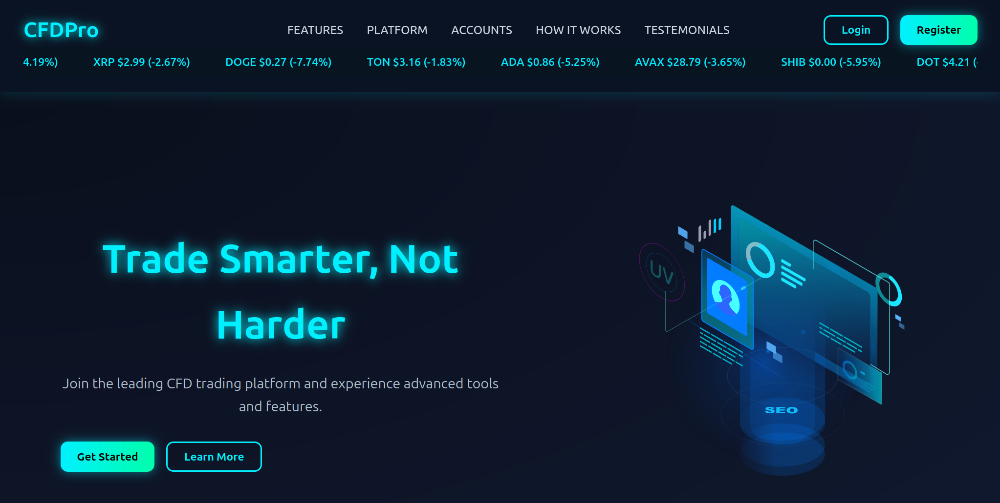

# Trading Simulation Platform + CRM

A **full-stack trading simulation demo** with an integrated **CRM**.  
Built using **Node.js, Express, MongoDB**, and a **vanilla JavaScript** frontend.

> ⚠️ **Disclaimer**  
This project is for educational and demonstration purposes only.

---





## Features

### Accounts & Profile
- Account number + account type auto-generated at registration.  
  ⚠️ Account numbers are short → **easy to crack** (demo only).
- User registration & login (**JWT authentication**).
- Password reset via email (Nodemailer / Mailtrap by default).
- Change password from profile.
- View and update profile details (name, country, phone, email).  
  ⚠️ No email confirmation or 2FA implemented.

### Trading & Transactions
- Simulated trading dashboard with **100+ coins**, fetching live prices from **Binance API**.
- Full trade history and transaction logs.

### Deposits
- Supports **BTC, ETH, USDT** deposits (real addresses configurable in `.env`).
- Transaction verified after **3 blockchain confirmations**.  
  User must click **Verify** → transaction is auto-uploaded.
- Transaction hashes are **one-time-use** (prevents duplicates).
- Deposits via **QR code or wallet address** (QR auto-generated).

### Withdrawals
- Fixed **4% withdrawal fee**.
- Requires a user-provided wallet address.  
  ⚠️ Validation is minimal.

### File Uploads
- Upload user documents (e.g., ID verification).
- Stored in MongoDB with **GridFS**.
- Files are **hashed for integrity**.  
  ⚠️ Not hardened against malicious uploads.

### Chatbot
- Simple integrated chatbot for basic navigation/help.

### CRM (Admin Functionality)
- **Dark/Light mode toggle**.
- View total clients and deposits.
- Access all transactions & trading history.
- Manually **add/cancel** transactions and inject fake trades.
- Inspect uploaded documents.
- Edit nearly all client fields (name, phone, country, password, status, etc.).
- Leave comments/notes in CRM (saved to DB).

---

## Security (Demo-Level)
- JWT tokens for sessions.
- Passwords hashed with **bcryptjs**.
- **Rate limiting** on login/auth routes.
- **Helmet** for secure HTTP headers.
- **CORS** restricted to trusted frontend origin.
- Centralized error handling + input validation.
- Auto delete email token after use for password reset.

⚠️ Still insecure by design — **do not trust this code with real users or funds.**

---

## Dependencies

**Backend**
- express  
- mongoose  
- dotenv  
- cors  
- helmet  
- bcryptjs  
- jsonwebtoken  
- nodemailer  
- multer  
- gridfs-stream  
- morgan  
- express-rate-limit  
- express-validator  
- axios  

**Frontend**
- Vanilla JavaScript (with `fetch`)  
- HTML / CSS  

**Prerequisites**
- Node.js  
- npm  
- MongoDB (local or Atlas)  

---

## Project Structure

```text

Platform/
 ├─ backend/
 │  ├─ models/           # Mongoose schemas
 │  ├─ node_modules/     # Backend dependencies / This will not be inside the zip after you run npm install it will create it
 │  ├─ routes/           # API routes
 │  ├─ uploads/          # File uploads
 │  ├─ utils/            # Helper functions
 │  ├─ validators/       # Input validation
 │  ├─ .env              # Environment variables / This will not be inside you will have to create .env follow the steps below
 │  ├─ .gitignore        # Ignored files
 │  ├─ package.json      # Backend dependencies
 │  ├─ package-lock.json # Dependency lock file
 │  ├─ server.js         # Main server entry point
 │  └─ test-storage.js   # Test storage logic
 │
 └─ frontend/
    ├─ assets/              # Images, fonts, static resources
    ├─ css/                 # Styling
    ├─ js/                  # Frontend logic
    ├─ node_modules/        # Dependencies / This will not be inside the zip after you run npm install it will create it
    ├─ dashboard.html       # User dashboard
    ├─ frontend-server.js   # Local dev server
    ├─ index.html           # Login/Register page
    ├─ package.json         # Frontend dependencies
    ├─ package-lock.json    # Dependency lock file
    ├─ profile.html         # User profile page
    ├─ reset.html           # Password reset
    └─ trading.html         # Trading page

CRM/
 ├─ crm-backend/
 │  ├─ models/           # Mongoose schemas
 │  ├─ node_modules/     # Backend dependencies
 │  ├─ routes/           # API routes (clients, transactions, etc.)
 │  ├─ .env              # Environment variables / This will not be inside you will have to create .env follow the steps below
 │  ├─ .gitignore        # Ignored files
 │  ├─ package.json      # Backend dependencies
 │  ├─ package-lock.json # Dependency lock file
 │  └─ server.js         # Main server entry point
 │
 └─ crm-frontend/
    ├─ .vscode/             # Editor settings
    ├─ css/                 # Styling
    ├─ js/                  # Frontend logic
    ├─ client-overview.html # Client overview page
    ├─ clients.html         # Clients list/details
    ├─ dashboard.html       # CRM dashboard
    ├─ settings.html        # Settings page
    └─ transactions.html    # Transactions history

```
Installation Guide
1. Clone 
```bash
git clone https://github.com/NT411/Trading-Simulation-Platform-CRM.git
```

2. Configure .env 

Create a .env file in both Platform and CRM backends.

Example:
```
#-------------------------------------------------------------------------------------
#-------------------------------------------------------------------------------------
FOR PLATFORM BACKEND
# -------------------------
# Backend Configuration
# -------------------------
PORT=5000
MONGO_URI=mongodb://127.0.0.1:27017/PLATFORM

# -------------------------
# Authentication / Security
# -------------------------
JWT_SECRET=your-ultra-secret-jwt-key
COOKIE_SECRET=secret-sauce-cookie-key
JWT_EXPIRES_IN=1h

# -------------------------
# Wallet Addresses
# -------------------------
BTC_TO_ADDRESS=your-btc-address-here
ETH_TO_ADDRESS=your-eth-address-here
# USDT uses the same address as ETH

# -------------------------
# Email (Nodemailer / Mailtrap)
# -------------------------
EMAIL_HOST=sandbox.smtp.mailtrap.io
EMAIL_PORT=2525
EMAIL_USER=your-mailtrap-username
EMAIL_PASS=your-mailtrap-password
EMAIL_SECURE=false

# Password reset link base
RESET_LINK_BASE=http://127.0.0.1:5500/reset.html

# -------------------------
# CORS
# -------------------------
FRONTEND_ORIGIN=http://127.0.0.1:5500
CLIENT_ORIGIN=http://127.0.0.1:5500,http://127.0.0.1:5501

# -------------------------
# Express
# -------------------------
TRUST_PROXY=false


#-------------------------------------------------------------------------------------
#-------------------------------------------------------------------------------------
FOR CRM BACKEND
# -------------------------
# Backend Configuration
# -------------------------
PORT=5001
MONGO_URI=mongodb://127.0.0.1:27017/PLATFORM
# -------------------------
# CORS
# -------------------------
FRONTEND_ORIGIN=http://127.0.0.1:5501
CLIENT_ORIGIN=http://127.0.0.1:5501
# -------------------------
# Express
# -------------------------
TRUST_PROXY=false
#-------------------------------------------------------------------------------------
#-------------------------------------------------------------------------------------
```
3. Install Dependencies

From each backend folder:

```bash
npm install
```
```bash
node server.js
```
4. Run Frontend

Use VS Code Live Server (or any static server):

Platform Frontend → http://127.0.0.1:5500

CRM Frontend → http://127.0.0.1:5501 

If you misconfigure the ports, nothing will work — make sure all ports match (assuming you haven’t changed anything).
Also, when you run the live servers you must not run them from the main Project folder. Instead, you must run them from their own folders: CRM and Platform.

Frontend (Platform): 5500
Frontend (CRM): 5501
Backend (Platform): 5000
Backend (CRM): 5001

